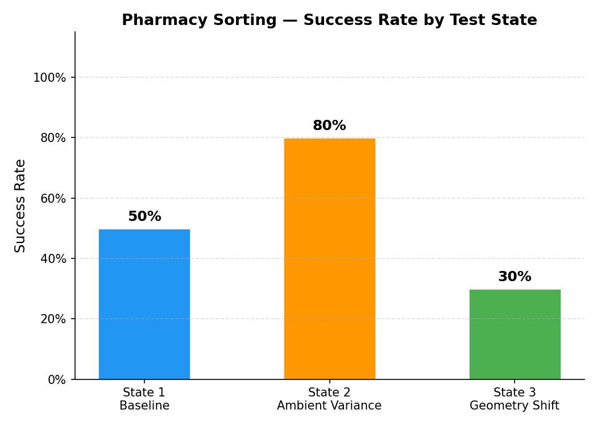
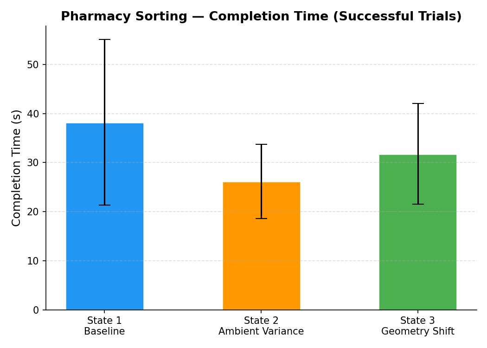
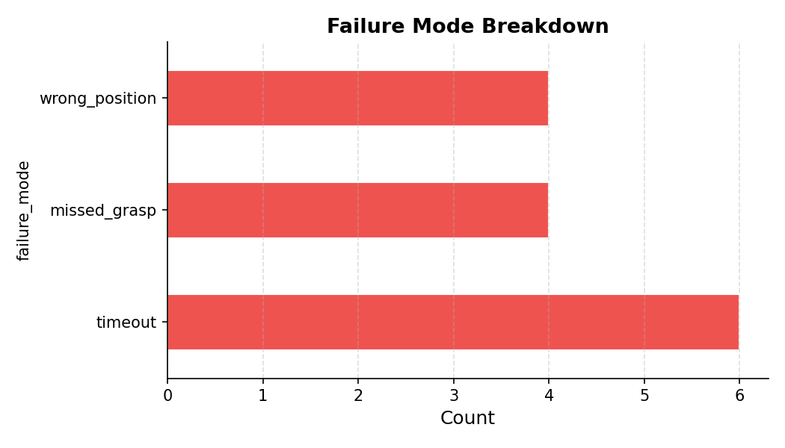

# Pharmacy Logistics Sorting Assistant

**TECHIN 517 Final Project — Wei Chang (weiccc24) — UW GIX MSTI Spring 2026**

A unimanual SO101 robot arm trained via ACT (Action Chunking Transformer) imitation learning to pick up an orange pill bottle and sort it into a designated bin. The policy was trained with the LeRobot/Rosetta pipeline and evaluated across three experimental conditions.

- **Demo video:** [Trial6_Baseline_demo ](https://drive.google.com/file/d/1mJWoPWveSMwVZ6PIgFV2uj4DsJnEkiEO/view?usp=sharing)
- **Trained model:** [weiccc14/pharmacy_sort_act](https://huggingface.co/weiccc14/pharmacy_sort_act) on Hugging Face
- **Training data:** 35 teleoperation episodes (collected via leader→follower arm mirroring)

---

## What It Does

The robot arm picks up an orange pill bottle placed at a marked position on the table and drops it into a small bin. The policy was learned entirely from human demonstrations — no explicit grasping logic or inverse kinematics was written. The input observations are:

- **Wrist camera** (XWF-1080P, `/dev/video6`) — close-up view from the arm's end-effector
- **Overhead camera** (Intel RealSense D435i, serial `846112072772`) — top-down workspace view

Actions are the 6 joint angles of the SO101 follower arm (shoulder, elbow, wrist x3, gripper).

---

## Project Journey

### Original Plan vs. What Was Built

The project was originally scoped as a multi-object pharmacy sorting system using YOLO-World detection and MoveIt2 inverse kinematics: detect pill bottle / medicine tube / eye gel box with the overhead camera, then command MoveIt2 to pick and route each object to the correct bin slot.

During implementation, the MoveIt2 pipeline proved unreliable for fine grasping — the planner often produced jerky paths or failed to plan near the table surface. Switching to ACT imitation learning (via the Rosetta inference pipeline already set up for labs) turned out to produce much smoother, more natural motion because it directly replays learned trajectories. The final design uses a single object (orange pill bottle) and a single policy trained end-to-end.

### Training

- **Episodes collected:** 35 teleop demonstrations via leader-follower arm mirroring
- **Pipeline:** LeRobot `record` → HuggingFace dataset `weiccc14/pharmacy_sort_act` → ACT training
- **Policy hosted on HuggingFace:** [weiccc14/pharmacy_sort_act](https://huggingface.co/weiccc14/pharmacy_sort_act)
- **Inference:** Rosetta lifecycle node consuming the trained checkpoint, running at ~280 ms/chunk on CPU (no NVIDIA driver accessible inside the Docker container)
- **Classical control layer:** The ACT policy outputs target joint angles which are tracked by ROS2 `forward_command_controller` — a classical PID joint position controller running at 50 Hz. The learning component decides *where* to move; the classical controller closes the loop to get there.

### Evaluation

30 trials were run across three experimental conditions (10 each). Each trial: arm at home position → policy runs → bottle either lands in bin (success) or 30 s timeout fires (failure). A custom shell script (`run_trial.sh`) started the Rosetta action, displayed a live timer, and logged the result to CSV automatically.

---

## Quantitative Results

### Setup

| Parameter | Value |
|---|---|
| Arm home position | `[-0.078, -1.872, 1.543, -1.733, -1.664, 0.0]` (radians) |
| Pill bottle start | Upright on tape mark, consistent orientation |
| Policy timeout | 30 s (`max_duration_s: 30.0`) |
| Actions per chunk | 30 (`actions_per_chunk: 30`) |
| Inference device | CPU (CUDA unavailable in container) |

### Experimental Conditions

| State | Description | Change from baseline |
|---|---|---|
| `baseline` | Pill bottle at tape mark, lab overhead lighting | — |
| `ambient_variance` | Same position, directional desk lamp casting heavy directional shadows | Lighting only |
| `geometry_shift` | Bottle shifted ~5 cm off tape mark and rotated ~90° | Object pose only |

### Results Summary

| State | Success Rate | Successes | Mean Time (s) | Std (s) |
|---|---|---|---|---|
| Baseline | 50% | 5 / 10 | 38.2 | 16.9 |
| Ambient variance | **80%** | 8 / 10 | 26.1 | 7.6 |
| Geometry shift | 30% | 3 / 10 | 31.8 | 10.2 |
| **Overall** | **53.3%** | **16 / 30** | — | — |

### Charts

**Success rate by condition:**



**Completion time (successful trials only):**



**Failure mode breakdown (all conditions combined):**



### Interpretation

- **Ambient variance (80%)** outperformed baseline, suggesting the additional directional lighting may have actually improved visual contrast for the wrist camera, making the bottle easier to grasp.
- **Geometry shift (30%)** dropped sharply — the ACT policy is sensitive to the bottle's position and orientation since the training data always had the bottle at the same tape mark. When shifted, the arm approached the wrong point or stood still entirely (no motion at all, recorded as `wrong_position`).
- **Baseline failures** were mostly `missed_grasp` (2) and `timeout` (2) — the policy approached but could not close the gripper reliably, or ran through the full 30 s without completing.

Raw trial data: [results/trials_raw.csv](results/trials_raw.csv)

---

## Difficulties and How They Were Solved

### 1. CUDA not available inside Docker container

The Rosetta policy server defaulted to `policy_device: "cuda"` but the Docker container had no NVIDIA driver access. The server crashed immediately on every goal with:

```
RuntimeError: Found no NVIDIA driver on your system.
```

**Fix:** Changed `policy_device` to `"cpu"` in `ros2_ws/src/rosetta/params/rosetta_client.yaml`. Inference slowed to ~280 ms per 30-action chunk but was stable.

### 2. Rosetta lifecycle node stopped activating

The Rosetta client is a ROS 2 lifecycle node (unconfigured → inactive → active). The launch file used `OnStateTransition` to chain configure → activate automatically. Under CPU load, the lifecycle service response occasionally timed out with:

```
RuntimeWarning: failed to send response (timeout)
```

This left the node stuck in `inactive` state — the action server existed but rejected all goals. Restarting rosetta was required, and this happened multiple times during trials.

**Fix:** Replaced `OnStateTransition` with two `TimerAction` handlers (configure at 2 s, activate at 10 s after process start). Fixed-delay timers fire regardless of service response latency.

### 3. Arm moved spontaneously between trials

After a trial ended, the Rosetta client still had an active goal internally. When the next trial started, the client sometimes re-executed the previous trajectory, moving the arm before the bottle was placed and reset.

**Fix:** Added `~/techin517/home.sh` at the end of every trial — it publishes a direct joint command to snap the arm back to the home position immediately after the action is cancelled, clearing any residual motion.

### 4. RealSense D435i camera connection instability

The overhead RealSense camera occasionally failed to enumerate on USB, or the `realsense2_camera` node crashed mid-session with a USB bandwidth error. When this happened, the bringup terminal dropped and the entire robot stack needed a restart (bringup + rosetta).

**Workaround:** Restarted the bringup stack and confirmed `/follower/image_raw/compressed` was publishing at ~30 Hz before continuing trials. The camera USB port and bandwidth were not further diagnosed within the project scope.

### 5. `ros2 control` service not reachable

During some restarts, `ros2 control list_controllers` returned "cannot contact service". This turned out to be a namespace issue — the controller manager runs under `/follower/`, not the root namespace — so the plain `ros2 control` command couldn't reach it.

**Workaround:** Checked controller status directly from the bringup terminal output instead of querying via CLI.

### 6. Action goal rejected ("already running")

After restarting rosetta during a session, the previous goal handle was sometimes still cached. The next `run_trial.sh` call received `Goal was rejected` immediately.

**Fix:** Letting the rosetta client go through a fresh lifecycle activate (not just restart from `inactive`) cleared the stale goal. Added a checklist in `run_trial.sh` to confirm the client shows "Activated and ready" before starting.

### 7. Geometry shift condition — arm holds position

For many geometry_shift trials, the arm approached and then stopped without moving to grasp. This is the expected effect of distribution shift: the ACT policy was trained with the bottle at the exact tape position, and when the bottle was moved 5 cm away and rotated, the visual observations fell outside the training distribution. The policy outputs near-zero velocity and the arm holds position.

This is recorded in the results as `wrong_position` (arm moved toward wrong location) or `timeout` (arm didn't move meaningfully at all).

---

## Reproducing the Evaluation

### Prerequisites

- SO101 follower arm on `/dev/ttyACM0`
- Intel RealSense D435i on USB (serial `846112072772`)
- Rosetta policy server: `weiccc14/pharmacy_sort_act` on HuggingFace
- Docker devcontainer running (see repo root README)

### Steps

**Terminal 1 — robot bringup:**
```bash
source ~/techin517/ros2_ws/install/setup.bash
ros2 launch soa_bringup soa_bringup.launch.py
```

**Terminal 2 — Rosetta policy inference:**
```bash
source ~/techin517/ros2_ws/install/setup.bash
ros2 launch rosetta rosetta_client_launch.py
# Wait for: "Activated and ready for policy execution"
```

**Terminal 3 — run a trial:**
```bash
./home.sh                          # home the arm
./run_trial.sh 1 baseline         # run trial 1
# Press ENTER when bottle lands in bin = SUCCESS
# Let 30s expire if arm fails = FAIL → enter failure mode
```

State labels: `baseline` | `ambient_variance` | `geometry_shift`

**Generate results charts:**
```bash
MPLBACKEND=Agg python3 analyze_results.py \
    --csv results/trials_raw.csv \
    --out results/
```

---

## File Reference

| File | Description |
|---|---|
| `results/trials_raw.csv` | All 30 trial results (trial number, state, success, time, failure mode, notes) |
| `results/success_rate.png` | Bar chart: success rate per state |
| `results/completion_times.png` | Bar chart: mean ± std completion time per state |
| `results/failure_modes.png` | Horizontal bar chart: failure mode counts |
| `analyze_results.py` | Generates all charts from the CSV |
| `check_success.py` | YOLO-based CV success detector: grabs overhead RealSense frame, runs YOLOv8n, checks if pill bottle centroid falls inside calibrated bin ROI. Developed as automated evaluation tool; manual logging used in final 30 trials due to RealSense instability during sessions. |
| `soa_pharmacy_contract.yaml` | Rosetta contract file: camera topics, joint topics, prompt format |
| `~/techin517/run_trial.sh` | Shell script: starts policy action, live timer, logs result to CSV |
| `~/techin517/home.sh` | Resets arm to home joint angles after each trial |

---

## Acknowledgements

- [LeRobot — Hugging Face](https://huggingface.co/docs/lerobot/en/so101)
- [Rosetta inference pipeline — iblnkn](https://github.com/iblnkn/rosetta)
- [feetech_ros2_driver — JafarAbdi](https://github.com/JafarAbdi/feetech_ros2_driver)
- [SO101 robot — The Robot Studio](https://www.therobotstudio.com)
